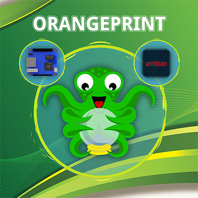

# ORANGEPRINT
---
[Will you invite me to a coffee?](https://www.paypal.com/cgi-bin/webscr?cmd=_s-xclick&hosted_button_id=9TT7E7XWEDAH8&source=url)

### ORANGEPRINT - Compilation for Orange Pi (Zero) for acontrolling a RepRap printer.

This is a project which tries to create a compilation of different elements to be able to control RepRap printers with the Octoprint software in Orange Pi (Zero) micro computers.

The idea arose when my friends asked me for my notes to create their own compilation and it was easier to create a manual at the beginning so that they could do it more easily ... which turned out to be a fiasco because having the manual before I had to indicate in person how to continue step by step, luckily I thought that the manual is well explained ...

So, I decided to create a generic copy-and-use compilation, they only had to configure WIFI and little else ... We'll see how it turns out.

Currently. There is the **Manual Orangeprint** discontinued where you will find all the information to create your own compilation, it can also serve as a point of support and learning of many concepts necessary to use an Orange Pi as a print server.

You will also find the first version which  works 100% for the Compilation for the SD of an ** Orange Pi Zero ** which is precisely the one I use personally without problems.

The Idea little by little, is to create a WIKI where not only the content of the manual is moved, but also include additions and solve common problems ... 
(and if you like the project and get support)
Well, everything will go.

For now I leave you with the main features included in the first version of this my humble work for the community.

### Features v1.0 

* ARMBian v5.35 server - Ubuntu xenial 3.4.113.
	* Last update (01-12-2018).
  * Resize (expand) the partition to the maximum available in our SD with our first reboot.

* Octoprint 1.3.6
	* URL Access: xx.xx.xx.xx: 5000
	* User 'orangeprint' Password 'orangeprint'
	* Self-running Server Octoprint (Daemon)
        
* Octoprint Plugins:
	* Emergency Stop Button (0.1.2).
	* GCODE System Commands (0.1.1).
  * Navbar Temperature Plugin (0.9).
  * Preheat Button (0.2.0).
  * PSU Control (0.1.7).
  * System Command Editor (0.3.1).
  * TouchUI (0.3.11).

* Motion (Control by WebCam)
	* Self-running Motion Server (Daemond)
	* URL local control by xx.xx.xx.xx: 8080
	* URL Monitor xx.xx.xx.xx: 8081
   
* Time Zone, Language and Keyboard of Spain.
* Python (2.7).
* pip (1.9.1).
* PySerial.
* Configured GPIO (WIRINGOP-Zero).
	* RELAY configured on pin 7 (Power On).
	* [Relay connection scheme](https://raw.githubusercontent.com/carlymx/orangeprint/master/future/imgs/OrangePi%20%2B%20Rele%20-%20Esquema.jpg)

* Access SSH: User 'root' Password 'orangeprint'

* SAMBA configured
	* Shared directory:
		* /home/orangeprint/share/
		* /home/orangeprint/.octoprint/uploads/
		* /home/orangeprint/.octoprint/timelapse/

_**All software used here, is owned by their owners and has nothing to do with me, nor me with them.
This compilation is a contribution that is made to the Open Source community for my part in a disinterested manner and in my free time, for which I can not be held responsible for any problem of any kind derived from the malfunction of the software used or its misuse.
Feel free to collaborate if you believe that this project could be more than a personal compilation contributed to the community.
Thank you very much for trying my work and I hope it will serve you as much as it is serving me.**_

...

