**ORANGEPRINT:**COMO CONFIGURAR UNA ORANGE PI PARA CONTROLAR IMPRESORAS REPRAP
==============================================================================

INTRODUCCIÓN
============

Aveces me da la impresión que nada me sale bien, que por mucho que me esfuerce
esto no esta hecho para mi. Se hace dificil, tedioso y complicado encontrar hoy
en dia información bien estructurada y explicada para casi cualquier tema, a
todo el mundo le parece salir todo bien a la primera como si fueran mega
ingenieros que han inventado lo que nosotros intentamos imitar.

Sigues los pasos al pie de la letra y sorpresa… ningúno de tus resultados se
asemeja lo mas minimo a lo que te muestran esos “mega ingenieros” y por si fuera
poco tienes de libiar con su falta de gramatica, su pobre vocabulario, su falta
de coherencía y sus faltas de ortografia.

Resulta ser en realidad un convenio de todo, lo que puede servirle para uno otro
por el mero hecho de tener una revision diferente del hardware ya no le vale, o
por tener un periferico diferente, tambien la fecha en la que se escriben los
articulos hacen que la gente busque cosas que ya no existen, una de mis
preferidas es esa circunstancia que marca todas las pautas, programas e
indicaciones para un hardware en concreto y que no valen para nada en tu caso,
por supuesto. Total, una serie de catastroficas desdichas hacen que se le quiten
las ganas a uno de hacer nada.

He destinado mucho tiempo a crear este manual y lo que le queda, solo intento
compactar los conocimientos adquiridos para que sea mas facil a otros y a mi
mismo tener la base de lo necesario para poder trabajar.

Así pues, espero que estas linear les puedan servir de ayuda y consigan como yo
poder poner en marcha y usar con gozo esta maravillosa mezcla de tecnologias y
saber humano.

Suerte.

PD: esta es una version preliminar sin corregir, cualquier comentario,
corrección y ayuda de todo tipo es bienvenida. Si creen que hay algo que seria
interesante añadir por favor ponganse en contacto.

INDICE
======

-   *1. Preparativos:*

    -   *1.1 Hardware.*

    -   *1.2 Software.*

-   *2 Instalación del Sistema Operativo ARMbian.*

-   *3 Acceso a la OPI sin monitor o pantallas por SSH:*

    -   *3.1 Configuración del Router.*

    -   *3.2 Acceso por SSH*

-   *4 Configuración del Sistema Básico:*

    -   *4.1 Actualizar el sistema.*

    -   *4.2 Zona horaria, Leguaje y Teclado.*

    -   *4.3 Conectar la WIFI.*

-   *5 Instalar dependencias y programas básicos:*

    -   *5.1 Instalar Python.*

    -   *5.2 Crear usuario para Octoprint.*

    -   *5.3 Instalar herramienta PySerial.*

-   *6 Instalación de Octoprint:*

    -   *Instalación del servidor de impresión Octoprint.*

    -   *Configuración básica por asistente.*

    -   *Convertir a Octoprint en un Servicio (Daemon).*

-   *7 Herramientas y Saberes Útiles a tener en cuenta:*

    -   *7.1 Como Saber la calidad de la señal WIFI.*

    -   *7.2 Copia de Seguridad de la SD por USB.*

    -   *7.3 Acceso ssh directo sin identificarse.*

    -   *7.4 Acceso al Directorio ‘Upload’ por Red Local.*

    -   *7.5 Control visual a través de WebCam.*

-   *.*

-   *.*

-   *.*

-   *.*

-   *.*

-   *.*

-   *.*

-   *98 Manuales, Esquemas y URLs con información.*

-   *99 Comandos Útiles.*

1 PREPARATIVOS:
================

1.1 HARDWARE
------------

Aquí una lista de todo lo que en un principio tendremos de tener y/o usar en
algún momento determinado con lo que al hardware se refiere. En algunos casos
adjunto link directo a Webs Oficiales o a búsquedas donde podrán encontrar lo
que necesitan.

-   Orange Pi Zero 512MB RAM r1.1+ ([Link Tienda
    Oficial](https://es.aliexpress.com/store/product/New-Orange-Pi-Zero-H2-Quad-Core-Open-source-512MB-development-board-beyond-Raspberry-Pi/1553371_32761500374.html?spm=a219c.search0104.3.1.fVemSp&ws_ab_test=searchweb0_0,searchweb201602_3_10152_10065_10151_5490020_10068_5530020_5500020_5560011_5550020_10307_10301_10137_10303_10060_10155_10154_10056_10055_10054_10059_5470020_100031_10099_5460020_10338_10103_10102_440_10109_10052_10053_10107_10050_10142_10051_5520020_5380020_10326_10084_10083_10080_10082_10081_10110_10111_10176_10112_10113_10114_143_5570011_10312_10313_10314_5510020_10184_10078_10079_10073,searchweb201603_23,ppcSwitch_5&btsid=8b9942cd-6557-457d-b4e6-250e5502dcfd&algo_expid=725d9857-20c3-4a11-b83d-f7e7a6d290a6-0&algo_pvid=725d9857-20c3-4a11-b83d-f7e7a6d290a6))

-   Tarjeta microSD \>= 4GBs (a más rápida mejor, Clase 10+)

-   Adaptador microSD a USB / USB2

-   Transformador a 5V \>1ª (Cargador de móvil)

-   Cable USB a Micro USB

-   Cable de RED RJ45

-   Un PC o Portátil con Windows o Linux

>   Opcionales pero interesantes o altamente recomendables:

-   PCB de Expansión USB para OPI Zero ([Link Tienda
    Oficial](https://es.aliexpress.com/store/product/New-Orange-Pi-Zreo-Expansion-board-Interface-board-Development-board-beyond-Raspberry-Pi/1553371_32770665186.html?spm=a219c.12010608.0.0.5208143VWvJhl))

-   Disipadores para CPU y RAM

-   Ventilador 40x40mm

1.2 SOFTWARE
------------

Una buena lista de software con sus links de descarga a fecha de hoy, pueden
probar si funciona con futuras actualizaciones del Sistema Operativo y
diferentes aplicaciones necesarias, e intentar que los repositorios sigan
vigentes.

-   Conexión a Internet y Acceso al Router

-   [Sistema Operativo ARMbian para OPI Zero](https://www.armbian.com/)

-   [Rufus v2.16+](https://rufus.akeo.ie/?locale)

-   [Putty SSH
    client](https://www.chiark.greenend.org.uk/~sgtatham/putty/latest.html)

Vamos a empezar.

2 INSTALACIÓN DEL SISTEMA OPERATIVO ARMBIAN
===========================================

Yo para mis quehaceres diarios yo uso Windows 10 en estos momentos, quien use
cualquier distribución Linux hay apartados que tendrá de apañárselas como pueda

En este manual se presupone que los usuarios que gusten el seguirlo ya conoces
los conceptos básicos y no tan básicos de la informática moderna y un tanto de
la vieja escuela, también algo de electrónica y una pequeñísima base conceptual
de las bases de la programación computacional.

“No intentéis correr sin antes aprender a gatear”.

Debemos descargar una de las versiones del Sistema Operativo ARMbian para la OPI
zero que podemos encontrar en su página web oficial (
<https://www.armbian.com/orange-pi-zero/> ) preferiblemente la versión ESTABLE y
descomprimir el paquete descargado en cualquier parte que tengáis a mano.

En mi caso descargue las siguientes versiones, si hay nuevas estables instalarla
ultima disponible:

Estable 3.4.113: <https://dl.armbian.com/orangepizero/Ubuntu_xenial_default.7z>

Y la Experimental 4.11:
<https://dl.armbian.com/orangepizero/Ubuntu_xenial_dev_nightly.7z>

Del momento y me he decidido a probar en esta mi enésima vez que instalo el
sistema para probar que tal funciona y también aprovechar para escribir este
manual.

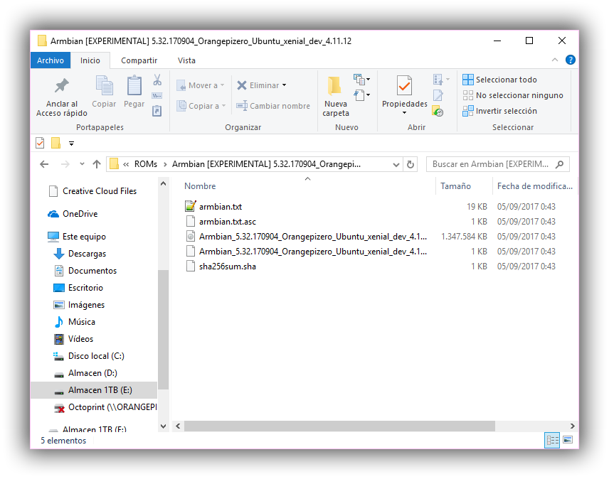

Contenido del paquete comprimido.

Una vez descomprimido podemos ver en el directorio que hay un archivo \*.IMG
este archivo binario es una copia del contenido inicial para nuestra SD y
precisamos un programa como el **Rufus** o el comando [dd en
Linux](https://es.wikipedia.org/wiki/Dd_(Unix)) para que nos la introduzca, ello
lleva toda la información de las particiones, sistema de archivos contenido y
orden de los directorios y archivos.

Por tanto, a la hora de introducir la imagen en nuestra tarjeta SD se van a
perder todos los datos que haya y van a ser sustituidos por el contenido de esa
imagen.

Otra cosa a tener en cuenta es que haya lo que haya se van a eliminar y
superponer las tablas de particiones y los sistemas de archivos, así que en
realidad no es necesario formatear previamente la tarjeta con ningún software.
De todas maneras, quien lo deseé puede hacerlo de varias formas.

-   Con el Administrador de Discos de Windows.

-   [Software OpenSource SD Card Formatter
    5+](https://www.sdcard.org/downloads/formatter_4/index.html).

-   Software de terceros como MiniTool Partition Wizard.

-   Y en Linux con comandos tipo [fdisk](https://wiki.ubuntuusers.de/fdisk/)

-   O aplicaciones de escritorio como
    [GParted](https://es.wikipedia.org/wiki/GNU_Parted) en GNome.

El procedimiento es muy sencillo:

1.  Se ejecuta el *Rufus*.

2.  Pinchamos a un *USB* el adaptador con la tarjeta introducida.

3.  En el Rufus seleccionamos en “*Dispositivos*” la nueva tarjeta SD.

4.  Más abajo, marcamos si no lo está *“crear disco de arranque con…”.*

5.  Seleccionamos al Desplegable *“Imagen DD“.*

6.  Y pinchando en el botón del lado derecho (*ese que es como un disco*).

7.  Seleccionamos la imagen *‘ xxxxxxxxx.img’* del sistema a instalar.

8.  Y pulsamos el botón *‘EMPEZAR’*, aceptamos las advertencias y esperamos.

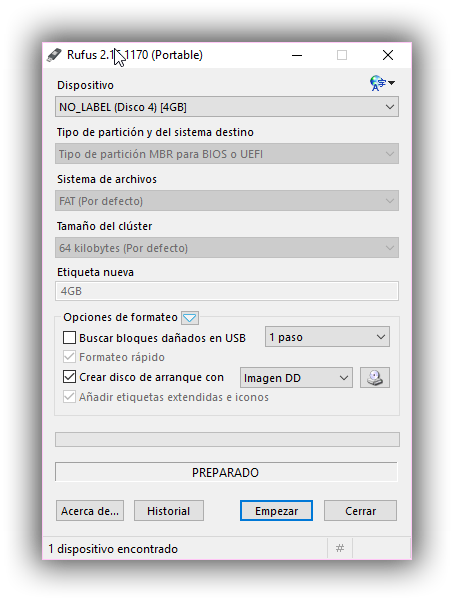

El proceso tardara unos minutos, una vez termine ya podemos introducir la
tarjeta SD en la Orange Pi Zero.

3 ACCESO A LA OPI SIN MONITOR O PANTALLAS POR SSH
=================================================

Una vez el sistema operativo haya sido transferido a la tarjeta microSD ya
podemos introducirla en la OPI.

“Importante que no tenga la alimentación conectada“

Luego conectamos el cable de RED al conector RJ45 de la misma y le conectamos la
corriente que viene del cargador de móvil al microUSB que trae la OPI y
empezaran a parpadear unas luces.

Una de las características de la OPI Zero es la falta de conector HDMI u otros
conectores hacia cualquier periférico de salida visual como televisiones o
monitores digitales o analógicos. Eso es debido en parte a su bajo coste y en
parte a que no le es necesario. Si es cierto por otro lado que el pin 9 del
conector de expansión de 13 pins es la salida analógica de video, el cual puede
conectarse a una televisión que acepte
[AV](https://ae01.alicdn.com/kf/HTB15KN6RpXXXXXjaFXXq6xXFXXXd/Audio-Video-font-b-AV-b-font-font-b-Cable-b-font-3-5mm-Headphone-font.jpg)
o con un conversor
[AV-EuroConnector](https://ae01.alicdn.com/kf/HTB10Wv2PXXXXXaSapXXq6xXFXXX5/Bloqueo-AV-adaptador-de-Euroconector-A-3-Rca-de-V&iacute;deo-Compuesto-o-S-video-Con-En.jpg).
También se puede usar el conector miniJack de la placa de expansión USB de la
OPI Zero para el mismo efecto dado que el miniJack conecta directamente a ese
pin.

“ Los pin 7 y 8 son los canales del Audio Stereo y el 10 la entrada de micrófono
“

De todas maneras como hemos adelantado no es necesario conectar la OPI a ningún
monitor o TV dado que podemos administrarla de manera remota desde cualquier
dispositivo que esté conectado dentro de nuestra red, por comodidad yo lo are
desde mi PC con el programa
[PUTTY](https://www.chiark.greenend.org.uk/~sgtatham/putty/latest.html) pero se
puede desde un dispositivo Android como un Smartphone, Tablet o SmartTV con APPs
cliente SSH como [Terminus SSH
client](https://play.google.com/store/apps/details?id=com.server.auditor.ssh.client&hl=es)
y Linux claro.

Estos programas básicamente nos crearan un túnel por el protocolo SSH seguro y
encriptado hacia la administración remota de nuestra OPI.

“ ARMbian para OPI Zero carece de base con un sistema grafico de control
(escritorio) así que todo se manipula a través de línea de comandos o [command
prompt](https://help.ubuntu.com/community/UsingTheTerminal) “

3.1 CONFIGURACIÓN DEL ROUTER.
-----------------------------

Unos segundos después de encender la OPI ya estará lista para poder acceder a
ella a través de SSH pero claro tenemos de averiguar que IP dinámica (DHCP) le
ha concedido el router a la misma de manera automática.

Para ello debemos entrar en la configuración de nuestro router y averiguar dos
cosas:

-   La [MAC](https://es.wikipedia.org/wiki/Direcci%C3%B3n_MAC) del Dispositivo
    de Red LAN.

-   La IP concedida a esa MAC.

En temas de routers cada uno es un mundo y debéis averiguar si no lo sabes
todavía, como acceder y configurarlo de manera avanzada. En mi caso tengo una de
Potaphone para fibra el cual en portada me muestra en “modo Experto“ un
dispositivo llamado ‘orangepizero’ con MAC ’02:42:64:xx:xx:xx’

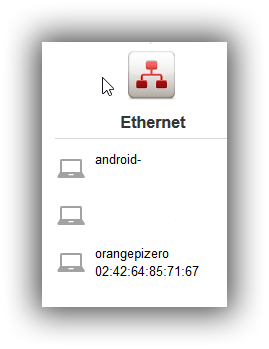

Y si me voy a la Configuración LAN puedo ver y administrar las conexiones DHCP a
voluntad. Es Importante asignar manualmente una IP fija para nuestra LAN de la
OPI para que el router no se le ocurra cambiarla en algún momento por cualquier
motivo y así poder acceder siempre a ella por esa IP.

En mi caso he asignado la IP fija ‘192.168.0.101’

Aplicamos, guardamos y si es necesario reiniciamos el router, una vez hecho eso
reiniciamos la OPI quitando el cable de alimentación esperamos unos segundos y
volvemos a conectarla.

Ahora la OPI ya tendrá siempre asignada a la LAN esa IP y podremos acceder con
el PUTTY.

3.2 ACCESO POR SSH
------------------

Ejecutamos el PUTTY.exe y nos aparecerá una ventana como la de la imagen, ahora
sin entrar en muchos detalles simplemente con poner en la barra de direcciones
la IP asignada en el router deberíamos poder conectar.

Al Presionar el botón ‘**OPEN**‘ debe aparecernos una ventana nuevo de color
negro y un mensaje que básicamente nos advierte que si queremos conectarnos
pulsemos ‘ **SI** ‘ y eso es lo que haremos.

Una vez dentro lo primero que nos pide es que ingresemos un Nombre de usuario y
posteriormente una contraseña.

“ Nombre de Usuario: *root* - Contraseña: *1234* “

Al introducir la contraseña notaran que al escribir no avanzan los caracteres,
no se preocupen es normal, Linux no muestra los caracteres de las contraseñas ni
su avance. Si se equivocan pueden borrar que sus efectos serán los esperados y
podrán intentar de nuevo

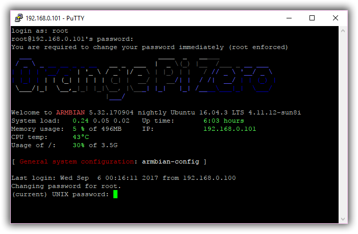

Este es el aspecto que debe tener la primera vez que entramos en ella, puede
verse el logotipo hecho con ASCiiArt, el nombre del sistema operativo y su
versión. La IP de la LAN la temperatura de la CPU y unas cuantas cosas más.

Entre ella las últimas líneas nos piden que para continuar cambiemos la
contraseña del superusuario *‘root’*. Empezando por poner la original de nuevo
*‘1234’*. Elegir una contraseña tan complicada como queráis y recordéis,
recordar que entraremos mil veces y la tendréis de poner mil veces para poder
continuar así que si alguien quiera poner los 100 primeros números del numero PI
allá él.

Luego nos pide que ingresemos un nuevo usuario, el cual rellenaremos al gusto yo
en mi caso pongo mi nombre. También puse la misma contraseña que puse para root,
así no me lio, pero aquí cada cual sus ganas de complicarse más la existencia y
sus paranoias…

Please provide a username (eg. your forename):………………  
Enter new UNIX password: …………………………………………..  
Retype new UNIX password: ………………………………………..

Luego nos mide la información básica de la cuenta como nuestro nombre y teléfono
pero lo podemos dejar en blanco pulsando *‘ENTER’* luego cuando pregunte si todo
está correcto escribimos *‘ Y ‘* y pulsamos *‘ENTER’* para confirmar.

Enter the new value, or press ENTER for the default           
Full Name
[]:                                                                                  
Room Number
[]:                                                                        
Work Phone
[]:                                                                             
Home Phone
[]:                                                                            
Other
[]:                                                                                          
Is the information correct? [Y/n]
                                                

Para Finalizar esta parte nos pedirá que reiniciemos la OPI, así que
escribiremos en el *‘Prompt’* el comando:

“ Comando para reiniciar: reboot ”

4 CONFIGURACIÓN DEL SISTEMA BASICO
==================================

Una vez se reinicie la OPI el PUTTY dará un mensaje de desconexión (obvio por
otro lado). No cerramos la ventana y esperamos a que el sistema se cargue de
nuevo luego podemos reconectar seleccionando sobre el menú contextual que
aparecer si pulsamos el botón derecho sobre la barra de título del programa
“Restart Sesion”.

Nos pedirá de nuevo el nombre de usuario y la contraseña, los cuales
ingresaremos como root y vuestra nueva contraseña. Veremos de nuevo el logotipo
de en ASCiiArt de nuevo y demás informaciones.

4.1 ACTUALIZAR EL SISTEMA
-------------------------

Una vez tenemos acceso y podemos empezar a trabajar con nuestro sistema debemos
cambiar un par de configuraciones, como el lenguaje por defecto, el tipo de
teclado y la zona horaria. Pero antes vamos a buscar actualizaciones del sistema
y decirle que nos las instale en caso que existan. Para ello usaremos los
siguientes comandos uno después del otro:

>   *sudo apt-get update*  
>   *sudo apt-get upgrade*  
>   *sudo reboot*

“ El comando ‘sudo’ indica operación administrativa, como cuando le decimos a
Windows que ejecute una tarea como Administrador… de hecho Microsoft es una de
las múltiples cosas que se ha copiado del ingenio Open Source… “

“Pueden pegar un texto en la línea del Prompt con el botón derecho del ratón”

 4.2 ZONA HORARIA, LENGUAJE Y TECLADO
----------------------------------------

El sistema por defecto está en inglés, el teclado en eslovaco creo y la zona
horaria de la luna como mínimo, para cambiar esto a nuestras preferencias
debemos seguir los siguientes pasos.

armbian-config

Con este script accederemos a ciertas configuraciones de manera sencilla. Para
mi entender hay cosas que faltan y hay cosas que sobran, pero todo se andará,
algunas me han funcionado por tanto eso que nos llevamos y otras pues no y he
tenido de buscarme la vida y hacerlo “a pelo“.

Al usar una versión beta de ARMbian aparece una versión del programita con más
cosas de las que trae el original de la versión estable, pero básicamente es lo
mismo. Buscaremos *‘Timezone’* pulsaremos *‘enter’* y buscaremos nuestra zona
horaria, en mi caso *‘Europa – Madrid’*

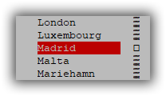

Ahora vamos a por el Idioma por defecto, hay dos formas:

1.  **Con la nueva interface de configuración** del sistema buscaríamos
    *‘Locales’* y buscaríamos nuestro idioma, en mi caso *‘ es_ES.UTF.8’* con la
    barra espaciadora sobre el nombre para activarlo en la lista.

>   Con la tecla *‘Tabulador’* buscamos el *‘OK’* y pulsamos ‘**ENTER**’ para
>   Aceptar. Nos saldrá una nueva ventana la cual nos pedirá el idioma por
>   defecto, seleccionaremos *‘es_ES-UTF.8’* y pulsamos ‘**ENTER**’. Al terminar
>   salimos de la interface de configuración y podemos comprobar los cambios
>   escribiendo el comando.

locale

>   Nos tiene de aparecer una lista con la aplicación del idioma para cada
>   situación algo así:  
>     
>   **LANG=es_ES.UTF-8                          **  
>   **LANGUAGE=en_US.UTF-8                      **  
>   **LC_CTYPE="es_ES.UTF-8"                    **  
>   **LC_NUMERIC="es_ES.UTF-8"                  **  
>   **LC_TIME="es_ES.UTF-8"                     **  
>   **LC_COLLATE="es_ES.UTF-8"                  **  
>   **LC_MONETARY="es_ES.UTF-8"                 **  
>   **LC_MESSAGES=en_US.UTF-8                   **  
>   **LC_PAPER="es_ES.UTF-8"                    **  
>   **LC_NAME="es_ES.UTF-8"                     **  
>   **LC_ADDRESS="es_ES.UTF-8"                  **  
>   **LC_TELEPHONE="es_ES.UTF-8"                **  
>   **LC_MEASUREMENT="es_ES.UTF-8"              **  
>   **LC_IDENTIFICATION="es_ES.UTF-8"           **  
>   **LC_ALL=                                   **

>   Una vez comprobamos que el idioma predominante es el Español, reiniciamos la
>   OPI con el comando **‘reboot’**.

1.  **A pelo,** Otra manera e incluso más completa que la anterior, es instalar
    y configurar el paquete de idiomas manualmente siguiendo esta secuencia de
    comandos:

-   Acceder al directorio locale.

>   *cd /usr/share/locales/*

-   Instalar el paquete de idiomas es_ES.

>   *sudo ./install-language-pack es_ES.UTF.8*

-   Editar los siguientes archivos de texto con herramientas como
    [nano](https://help.ubuntu.com/community/Nano).

>   *sudo nano /etc/environment*

>   Añadir al final del documento las siguientes líneas:

>   *\# File generated by update-locale*

>   *LC_ALL="es_ES.UTF8"*

>   *LC_MESSAGES="es_ES.UTF-8"*

>   *LANGUAGE="es_ES"*

>   *LANG="es_ES.UTF-8"*  
>   

>   *sudo nano /etc/default/locale*

>   Sustituir todas las líneas por:

>   *\# File generated by update-locale*

>   *LC_ALL="es_ES.UTF8"*

>   *LC_MESSAGES="es_ES.UTF-8"*

>   *LANGUAGE="es_ES"*

>   *LANG="es_ES.UTF-8"*

“ NANO es un editor muy simple pero potente, una vez editado, para guardar y
salir tienen de pulsar ‘Ctrl+X’ después ‘Y’ y ‘Enter’ ”

>   Luego crearemos un nuevo archivo llamado ‘local’ en un nuevo directorio
>   ‘suppoted.d’ dentro de otro nuevo directorio ‘locales’ dentro de ‘/var/lib/’
>   como sigue:

mkdir /var/lib/locales/  
mkdir /var/lib/locales/supported.d/  
sudo nano /var/lib/locales/supported.d/local

>   Y dentro pondremos las siguientes líneas que corresponden al orden de
>   preferencia de los idiomas:

>   *es_ES.UTC-8 UTC-8*  
>   *en_US.UTC-8 UTC-8*

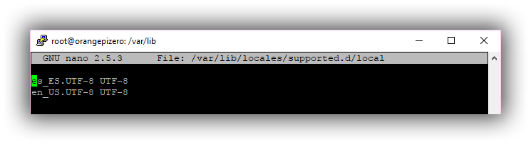

>   Este archivo nos servirá para indicarle a ARMbian cuál es el idioma
>   preferible, pero en caso de faltar cual será el siguiente a mostrar, pueden
>   ponerse tantos como se desee, aunque para mí ya me vale.

>   Posteriormente hay que seleccionar cual va a ser el idioma por defecto con
>   el siguiente comando que nos llevara a cierta pantalla ya conocida y
>   seleccionaremos **‘es_ES.UTF.8’**:

sudo dpkg-reconfigure locales

>   Después reiniciaremos y comprobaremos si todo ha sido cambiado con el
>   comando anteriormente utilizado:

Locale

Para el teclado es algo más sencillo, solo tenemos de conectar a la OPI un
teclado físico normal de toda la vida al USB, reiniciar y poner este comando que
nos abrirá un asistente nuevo.

sudo dpkg-reconfigure keyboard-configuration

Es importante poner el teclado porque si nos el asistente dará un error”.

Luego solo tienen de ir seleccionando sus preferencias de teclado, aquí les dejo
las mías, una línea por cada pantalla que aparece:

>   \> 'PC GENERICO 105 TECLAS'  
>   \> 'ESPAÑOL'  
>   \> 'ESPAÑOL'  
>   \> 'ALT DERECHO (AltGr)'  
>   \> 'SIN TECLA MODIFICADORA'

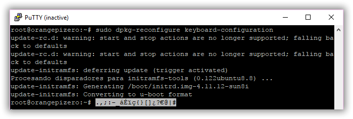

Y como pueden ver ya aparecen las tildes, el símbolo del Euro…. Vaya me falto
probar la ‘Ñ’ xDDD

4.3 CONECTAR LA RED WIFI
------------------------

Para mí que voy a usar la OPI dentro de una de mis impresoras me va genial no
tener desconectar un cable más y poder utilizarla a través de la red WIFI. Por
tanto, vamos a configurar la Red WIFI de manera que podamos utilizarla a partir
de entonces sin necesidades de conectar el cable de RED.

Lo primero que haremos es iniciar cierto asistente llamado ‘nmtui’ así que
siendo root escribiremos en el prompt el comando:

nmtui

Veremos la ventana del asistente y seleccionaremos ‘ Activate a connection ‘.

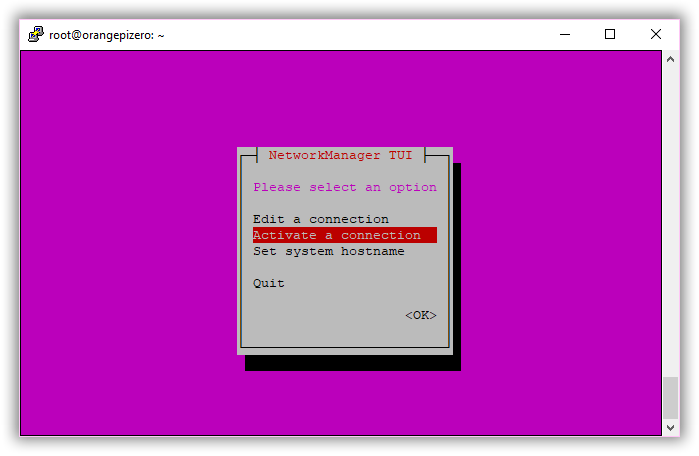

Buscaremos y Seleccionaremos nuestra conexión WIFI, Aceptaremos como siempre
pulsando **‘Enter’** y pondremos nuestra contraseña para acceder a la red. Una
vez termine, salimos del asistente y comprobaremos que se haya conectado con el
comando:

nmcli d

Bien, una vez hecho esto volvamos al router y podremos ver una nueva conexión de
la OPI pero esta vez con una MAC distinta, la de la conexión WIFI y una nueva IP
asignada por DHCP. Como en el caso de la Red LAN procederemos a asignar
estáticamente una IP fija (puede ser la que ya tiene asignada) para la MAC
correspondiente a la WIFI.

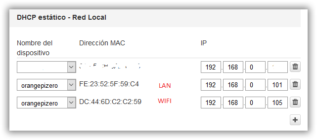

“La asignación de una IP estática hacia una MAC, se hace para que el router
reserve esa IP para ese dispositivo, así cada vez que ese dispositivo se conecte
siempre tendrá esa misma IP”

Al reiniciar la OPI el controlador WIFI empezara a trabajar sobre la IP asignada
y ya tendremos acceso desde la Red LAN como la inalámbrica. Pueden observar que
ahora aparecen en la pantalla de bienvenida dos direcciones IP.

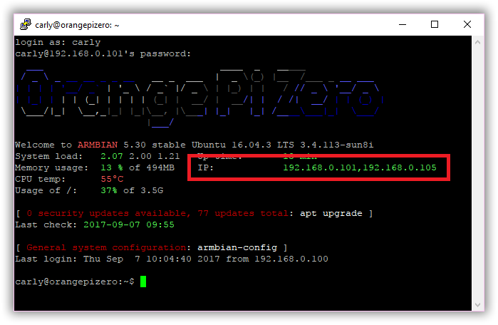

A veces hay ciertos problemas de conexión a través de la conexión WIFI al
protocolo SSH usando sistemas Windows… lo mío me costó encontrar que era debido
a que Windows gestiona mal en esos casos los protocolos IPv6 y es mejor
desactivarlos de la OPI en caso que tengáis problemas para conectaros.

Parta ello tenemos de crear un archivo nuevo he ingresarle una línea, guardar y
reiniciar el servicio de red.

sudo nano /boot/cmdline.txt

ipv6.disable = 1

sudo /etc/init.d/networking restart

Y ya está, reiniciamos de nuevo y ya podremos acceder desde Windows y PUTTY a la
gestión de la OPI por WIFI. En mi caso, ya puedo desconectar el cable de RED y
conectarme y continuar instalando desde ahí.

5 INSTALAR DEPENDENCIAS Y PROGRAMAS NECESARIOS
==============================================

Largo camino se ha recorrido ya, decenas de líneas hemos tenido de escribir y un
par de días nos ha costado llegar hasta aquí, y de momento no hemos hecho más
que configurar un poquito el sistema para poder empezar ahora a trabajar…

A partir de ahora como ya nos hemos vuelto unos expertos en la materia, la curva
de aprendizaje se va acelerar y lo vamos a tener todo listo en un santiamén.

Lo que vamos a hacer ahora es ‘ 1 – 2 – 3 ’ son los pasos a seguir para tener
operacional el servidor de impresión 3D Octoprint. Más adelante ya
profundizaremos si el tiempo lo permite.

Conectamos a nuestra OPI Zero por SSH como root y seguimos tal cual los
siguientes pasos.

-   Instalar Phyton v2.7: [El Python](https://es.wikipedia.org/wiki/Python) es
    un lenguaje de programación interpretado o de scripts necesario para el
    correcto funcionamiento de Octoprint en nuestra OPI.

sudo apt-get install python-pip python-dev git python-setuptools psmisc  
sudo apt-get update  
sudo apt-get upgrade

-   Crear un Usuario Nuevo para Octoprint, con este usuario y en su directorio
    personal, instalaremos el servidor Octoprint y ciertas herramientas más,
    para tenerlas controladas y por seguridad.

sudo adduser octoprint

Nos pedirá que pongamos una contraseña y demás cosas como al principio.  

sudo usermod -a -G tty octoprint  
sudo usermod -a -G dialout octoprint  
sudo adduser octoprint sudo

-   Cambiar de Usuario por el nuevo creado ‘Octoprint’ para empezar con la
    instalación.

sudo su octoprint

luego accederemos a su directorio ‘Home’ si no lo estamos ya, así:

cd /home/octoprint  
o así:  
cd \~

“ El carácter ‘ \~ ‘ que es la virgulilla de la letra ‘Ñ’ pero separado como
carácter independiente se consigue escribir en los teclados que carecen de ella
mediante la combinación ‘ Alt+126’ y en los terminales Linux con la tecla 'F5' “

-   Instalar [Pyserial](https://pythonhosted.org/pyserial/): Es una aplicación
    escrita en Python para la administración de las comunicaciones de los
    puertos serie (también USB) necesario para octoprint. Se instala como sigue:

wget <https://pypi.python.org/packages/source/p/pyserial/pyserial-2.7.tar.gz>  
tar -zxf pyserial-2.7.tar.gz  
cd pyserial-2.7  
sudo python setup.py install  
sudo apt-get update  
sudo apt-get upgrade

Estas líneas lo que harán es descargarse un archivo de internet con el comando
‘[wget](https://es.wikipedia.org/wiki/GNU_Wget)’ directamente al directorio
donde este alojado el prompt en ese momento. Con el comando
‘[Tar](https://es.wikipedia.org/wiki/Tar)’ descomprime el paquete y con el
script ‘setup.py install’ nos instala el paquete.

El programa integrado en el paquete de Python PIP a sufrido una actualización la
cual debemos instalar en este momento de la siguiente manera:

sudo pip install -U pip

Si todo va bien a día de hoy debe actualizarse a la versión 9.0.1 o superior lo
cual podéis averiguar si usáis el comando:

sudo pip --version

6 INSTALACIÓN DE OCTOPRINT
==========================

Llegados a este punto ya lo tenemos todo para poder instalar y usar una
configuración básica pero funcional de Octoprint a partir de entonces nos
dedicaremos a ampliar el potencial de nuestro servidor, pero eso será después de
imprimir nuestra primera pieza.

6.1 INSTALACIÓN DEL SERVIDOR DE IMPRESIÓN OCTOPRINT
---------------------------------------------------

Instalar Octoprint es tan sencillo como cualquier otro paquete anteriormente
instalado. Pero esta vez nos valdremos del comando
‘[git](https://es.wikipedia.org/wiki/Git)’ para clonar en nuestro directorio
‘home’ (del usuario Octoprint) la última versión del repositorio donde está
alojado el proyecto en los servidores de GitHub.com que podéis ver
[aquí](https://github.com/foosel/OctoPrint).

cd \~  
git clone https://github.com/foosel/OctoPrint.git  
cd OctoPrint  
sudo python setup.py install

De esta manera ya tendremos instalado el servidor Octoprint para el Usuario
‘Octoprint’ de manera general (en el PATH) y podremos iniciarlo como un comando
cualquiera más. Es hora de iniciarlo por primera vez como mínimo para verlo, así
que desde cualquier dirección del Prompt usaremos el comando:

octoprint

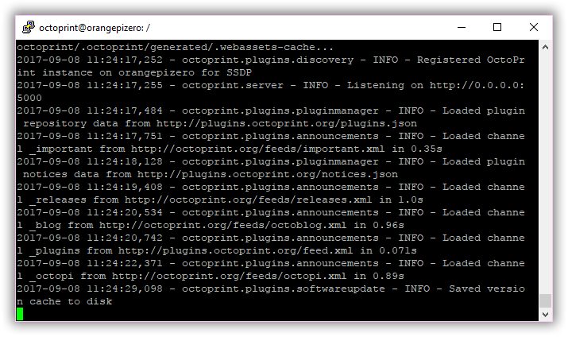

Como resultado el server empezará a mostrarnos el LOG de ejecución y se detendrá
en un punto sin Prompt en ese momento si no nos ha dado ningún error ya
tendremos en funcionamiento nuestro servidor. Pero ojo esa instancia del PUTTY
se nos ha quedado impracticable dado que está ejecutando el servidor, pero
nosotros queremos comprobar que el servicio este ejecutándose así que
duplicaremos la instancia sacando el menú contextual desde la barra de título
del PUTTY de nuevo y seleccionando ‘Duplicate Session’.

Eso nos abrirá otra ventana y nos pedirá que introduzcamos Nombre de Usuario y
Contraseña, entraremos como ‘ root ‘ y continuaremos.

Existe un comando llamado ‘[top](https://en.wikipedia.org/wiki/Top_(software))’
que nos abre una pequeña aplicación donde nos muestra entre otras cosas los
servicios en ejecución y el usuario que los ha llamado, también nos muestra la
carga de la CPU, memoria. Una aplicación sencilla pero muy útil para controlar
el gasto de CPU por ejemplo de cuando está imprimiendo y trasteamos con ella.
Según mi experiencia la OPI Zero da para mucho más que tener un servidor de
impresión y dos también. pero eso lo tocaremos más adelante.

top -i

Podremos observar que hay una línea que indica que el Usuario Octoprint ha
iniciado el servidor de impresión Octoprint y actualmente en reposo todos los
procesos de la OPI están usando aproximadamente un 7% de la CPU de los cuales un
1% lo está usando Octoprint y un 2% lo está usando el proceso TOP, en total algo
insignificante. Se sale del programa pulsando la tecla Q

El Servidor Web de impresión Octoprint usa por defecto el puerto 5000 así que
para poder acceder desde cualquier navegador de cualquier dispositivo conectado
a nuestra RED de casa (local) sea por LAN o WIFI tendremos que poner en la barra
de direcciones la IP de la OPI más el puerto 5000 así:

<http://192.168.0.105:5000>

6.2 CONFIGURACIÓN BASICA POR ASISTENTE
--------------------------------------

Este es el aspecto la primera vez que visualizamos la Web de control del
servidor de impresión.

“Si tenemos bloqueadores de anuncios y Scripts, debemos desactivarlos por
completo para esa dirección para que todo funcione como es debido”.

Al desactivar todos los ADBlockers y recargar la página web pulsando Ctrl+F5 nos
aparecerá un asistente de configuración básica donde pondremos lo siguiente:

Siguiente \>

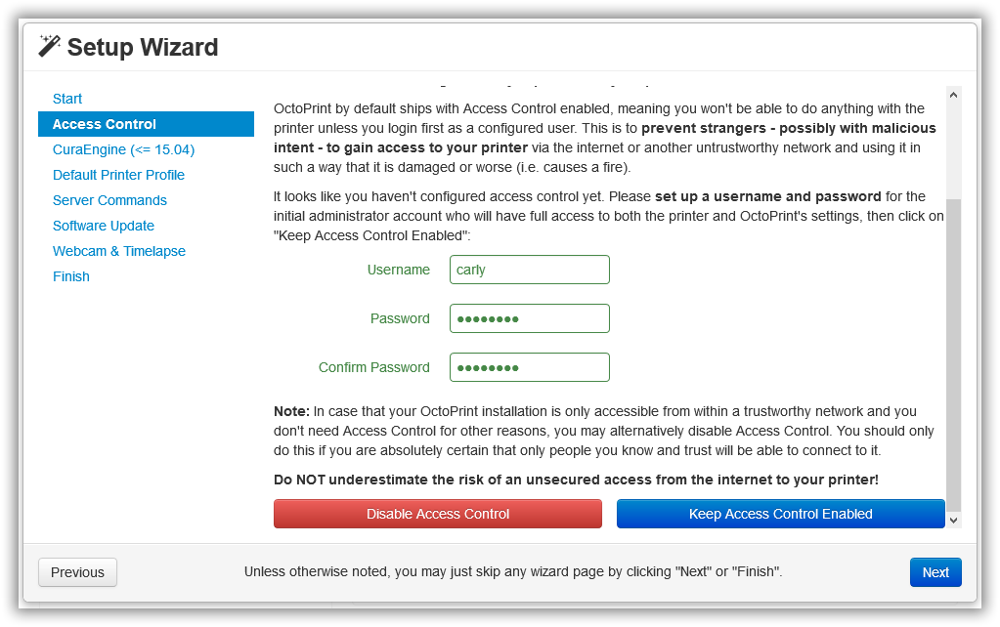

Creamos el usuario administrador del servidor.  
Su contraseña (recordarla…).  
pulsamos: Keep Access Control Enabled.  
Siguiente \>

La configuración del CuraEngine de momento pasamos dado que no lo hemos
instalado (yo no lo utilizo, subo directamente los GCodes ya hechos desde mi PC,
aun que todo se andará)  
Siguiente \>

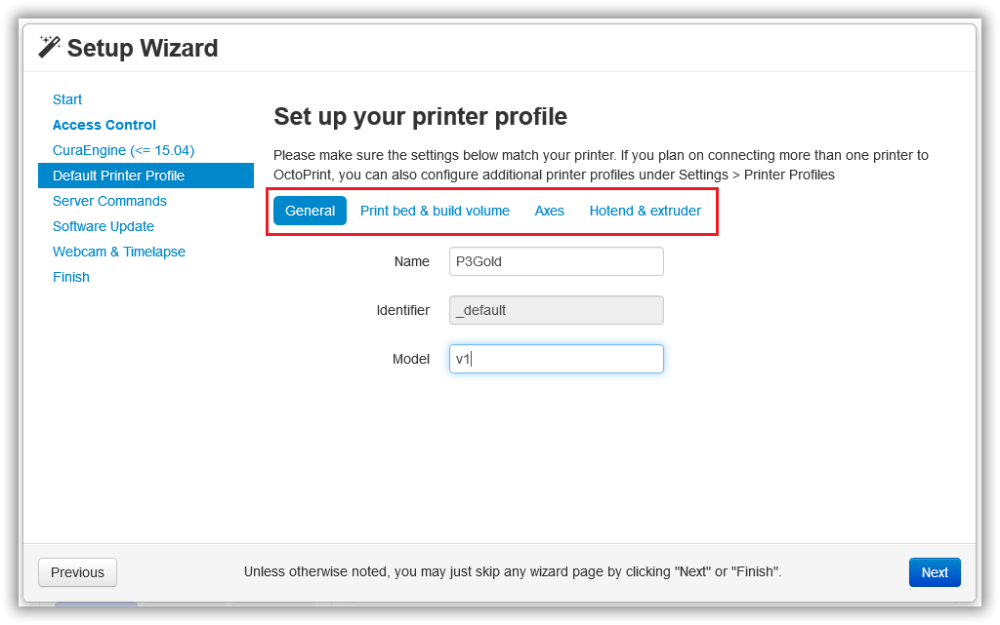

En esta ficha debéis configurar los aspectos básicos de vuestra impresora,
Nombre, Dimensiones de la superficie de impresión, velocidades máximas de la
misma, numero de Extrusores etc..

Siguiente \>

En Server Commands configuraremos los botones para poder Reiniciar y apagar la
OPI de la siguiente manera.  
Reiniciar Sistema: sudo shutdown -r now  
Apagar Sistema: sudo shutdown -h now

Luego debemos indicarle donde queremos instalar la próximas actualizaciones, en
nuestro caso en:  
/home/octoprint/OctoPrint/

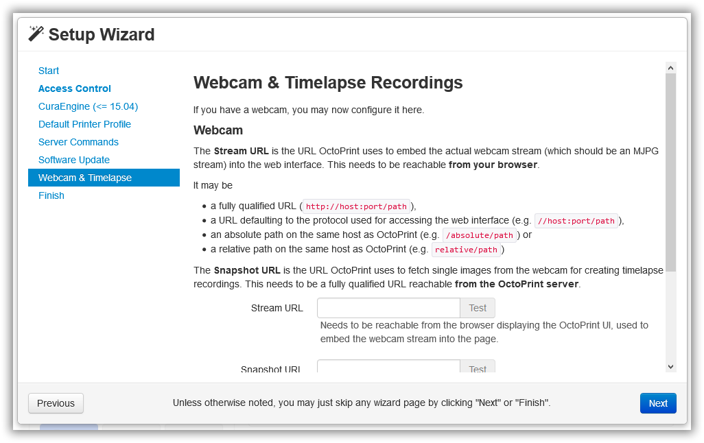

La WebCam de momento la dejaremos sin configurar y le daremos a siguiente y
habremos finalizado el asistente.

6.4 CONVERTIR OCTOPRINT EN UN SERVICIO (DAEMON)
-----------------------------------------------

Un gran problema de iniciar el Octoprint mediante una instancia del PUTTY si no
se han dado cuenta, es que, si cierran esa sesión, el servidor se detiene y eso
no nos interesa. Por tanto, vamos a crear un Script que se ejecute al iniciar la
OPI y que a su vez nos arranque un servidor Octoprint como un servicio más (un
Daemon).

Para ello iniciamos como ‘root’ o cambiamos a super-usuario (root) y crearemos
un archivo nuevo.

>   *sudo su*  
>   *cd /etc/init.d/*  
>   *sudo nano iniciar_octoprint.sh*

Y dentro del editor agregaremos al archivo estas líneas:

>   **\#!/bin/bash**  
>   **\#\#\# BEGIN INIT INFO**  
>   **\# Provides: Octoprint**  
>   **\# Required-Start: \$syslog**  
>   **\# Required-Stop: \$syslog**  
>   **\# Default-Start: 2 3 4 5**  
>   **\# Default-Stop: 0 1 6**  
>   **\# Short-Description: octoprint**  
>   **\# Description:**  
>   **\#**  
>   **\#\#\# END INIT INFO**  
>   **su octoprint -c 'octoprint'**

Esa línea básicamente indica solamente que se inicie de manera predeterminada el
servidor de impresión.

Después, tenemos de indicarle al ARMbian que ese archivo es un archivo
ejecutable y lo haremos con la siguiente línea:

sudo chmod +x /etc/init.d/iniciar_octoprint.sh

Si nos vamos a la ubicación del archivo *cd /etc/init.d/* y listamos con *ls*
todos los archivos, veremos cómo nuestro archivo es representado con letras de
*color verde*, eso significa que es un archivo ejecutable y por tanto de momento
vamos bien.

Ahora nos queda indicarle a ARMbian que ese archivo lo ejecute al inicio cuando
arranca el sistema usando esta línea. Luego reiniciaremos el sistema.

>   sudo update-rc.d iniciar_octoprint.sh defaults

Como nosotros iniciamos en modo “servidor” sin monitor, sin loguarnos y demás,
Necesitamos quitarle la contraseña al usuario octoprint porque si no el servicio
no se ejecutar. Tambien los comandos de apagado y reinicio del sistema desde la
aplicación web, no funcionaran si no quitamos la contraseña del usuario que
ejecuta ese servicio. Para ello editaremos un archivo con el comando siguiente:

sudo visudo

>   // añadir al final del archivo:  
>   octoprint ALL=(ALL) NOPASSWD:ALL

Luego solo queda ejecutar el siguiente comando y reiniciar:

>   sudo passwd octoprint -d  
>   sudo reboot

Si después de reiniciar, echamos un vistazo al comando ‘*top –i*’ podremos
observar que el Servicio octoprint ya se está ejecutando sin necesidad que nadie
lo inicie. Por tanto, ya podremos reiniciar alegremente que siempre tendremos el
servidor en marcha.

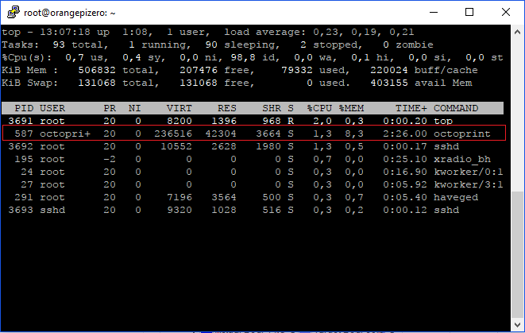

7 HERRAMIENTAS Y SABERES ÚTILES A TENER EN CUENTA
=================================================

7.1 Como Saber la calidad de la señal WIFI
------------------------------------------

Es muy interesante para los que utilizamos la conexión WIFI a nuestra RED el
saber al colocar la OPI en algún sitio si la señal llega con una intensidad
aceptable y la conexión a esa señal se realiza medianamente bien. Con el
siguiente comando no nos será necesario instalar nada y es muy fácil de saber lo
que necesitamos en algún momento dado.

watch -n 1 cat /proc/net/wireless

Básicamente como pueden ver en la foto nos aparece el **%** de la calidad de la
señal y se actualiza cada segundo, el tiempo de refresco se puede cambiar
cambiando el **1** del comando por **n** segundos que gustemos en poner.

Para salir pulsar **Ctrl+C**.

7.2 Copia de Seguridad de la SD por USB
---------------------------------------

Llegados a este punto y después de ciertas horas peleando para tener un sistema
que funciona, quizás a más de uno le interese tener una copia de seguridad del
contenido exacto de la tarjeta SD tal y como está por si llega a fastidiarse en
algún momento por lo que sea. Hay varias maneras de hacer una copia de
seguridad.

**Poner la tarjeta en un PC con Linux** y hacer la copia con el comando *dd*

>   **Poner la Sd en un sistema con Windows** y si tienes la suerte que te pone
>   una letra de unidad a la partición de la tarjeta, bien por ti dado que
>   puedes usar un programa llamado
>   [Win32DiskImager](https://sourceforge.net/projects/win32diskimager/),
>   seleccionar esa unidad, decirle donde quieres y con qué nombre
>   *‘copiadeseguridad.img’* quieres guardar la copia y pulsar el botón
>   **READ**.

**Poner un PenDrive al USB de la OPI Zero** y hacer una copia de la SD
directamente a ese USB.

**Hacer una copia por RED** de la SD directamente a un Directorio compartido o
unidad de RED.

En este tutorial explicaremos las dos últimas formas, usando un pendrive y a
través de la RED, aunque ya se ha explicado todo lo que se debe hacer en Windows
y una vez se sepa usar el comando *dd* para hacer una copia desde la OPI al USB
por eliminación también sabrán hacer una copia de la SD desde cualquier Linux.

El procedimiento es muy sencillo, Necesitan un Pendrive o HDD-USB igual o
superior al tamaño de la tarjeta SD y que tenga el espacio necesario para hacer
un archivo del contenido íntegro bit a bit de la tarjeta SD eso también implica
el espacio vacío. Ojo con eso como los tamaños de los archivos y el tamaño en
disco de ellos varía según ciertos motivos que no vamos a explicar
[aquí](https://www.google.es/search?source=hp&q=diferencia+entre+tama%C3%B1o+de+archivo+y+tama%C3%B1o+en+disco&oq=diferencia+entre+tama%C3%B1o+de+archivo+y+tama%C3%B1o+en+dis&gs_l=psy-ab.3.0.33i22i29i30k1.1688.23057.0.24216.55.52.1.0.0.0.202.5508.16j32j1.49.0....0...1.1.64.psy-ab..5.47.5178.6..0j35i39k1j0i131k1j0i67k1j33i160k1j33i21k1j0i22i30k1.S-hhZM8w17k).
Recomendamos directamente dispositivos más grandes para evitar problemas.

Hay que tener en cuenta también el tipo de partición con la que esta formateado
ese dispositivo, un pendrive o HDD que tenga el sistema de archivos FAT32 no nos
sirve en un principio por que el archivo máximo que puede manejar ese tipo de
particiones es de 4GBs si estamos usando una SD de 8GBs o más no nos servirá… y
es posible que tampoco si usamos una SD de 4GB dado que la copia resúltate será
un archivo del tamaño integro de la SD + lo que ocupa tenerla alojada en un
disco. Las particiones recomendadas son NTFS (Windows NT) y ext (Linux).

Pinchamos nuestro dispositivo al USB de la OPI y en unos segundos debe haberlo
reconocido, para cerciorarnos usaremos el comando:

fdisk –l

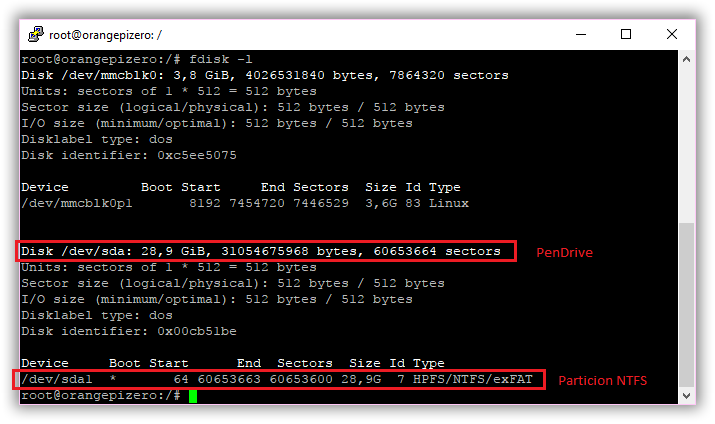

Podremos observar que nos ha identificado un dispositivo en **/dev/sda de
28.9GBs** (en mi caso) y una partición NTFS en **/dev/sda1**. Ahora vamos a
proceder a montar esa partición, para ello debemos crear un directorio en /media
y montar esa partición de la siguiente manera:

mkdir /media/USB

mount /dev/sda1 /media/USB

Una vez montada la partición, podremos visualizar su contenido en /media/USB
como cualquier directorio más de nuestro sistema.

cd /media/USB

ls

Ya tenemos acceso, ahora lo siguiente seria desmontar la partición 1 de la
tarjeta SD que es en mi caso **/dev/mmcblk0p1** tal y como nos mostró el
anterior *fdisk -l* de la siguiente forma:

sudo umount /dev/mmcblk0p1

“Cuando desmontas la tarjeta SD parte del sistema continúa estando operativo
porque está cargado en RAM”

Ahora solo queda decirle a ARMbian que nos clone el contenido de la tarjeta SD
(el dispositivo entero, no una partición concreta, así nos hace una copia de
todo, todo y todo) en la partición montada del Pendrive (o HDD) con un nombre
especifico (*nombre_copia_seguridad.img*)

sudo dd if=/dev/mmcblk0 of=/media/USB/mibackup.img bs=1M

Observar que el comando es **dd**, **if=** es el que queremos copiar, **of=**
donde queremos copiarlo y **bs=1M** significa que vaya guardando en disco cada
1MB.

Al ejecutar el comando empezara con la copia de manera que la instancia del
PUTTY se queda trabajando y no podemos hacer nada con ella (ni debemos)
esperaremos hasta que termine (4GB me tardo unos 12 minutos). Cuando termine
podremos ver el resultado entrando dentro del directorio (partición o unidad
montada)

cd /media/USB

ls –s

Ahora solo queda reiniciar la OPI, coger ese archivo \*.img comprimirlo y
archivarlo en un lugar seguro. Nótese que al comprimir el archivo mengua
drásticamente dado que la parte del archivo que simboliza el espacio vacío de la
tarjeta SD es fácilmente comprimible (1millon de ceros es casi lo mismo que un
cero).

7.3 Acceso ssh directo sin identificarse
----------------------------------------

Una cosa interesante que podemos hacer para mejorarnos un poco la existencia es
preparar al PUTTY para que nos auto-identifique en nuestras conexiones por ssh
con la OPI, es un proceso muy sencillo que se lleva a cabo de manera indirecta
creando un acceso directo al escritorio mismo o con un archivo de proceso por
lotes tipo **\*.BAT**.

>   **Acceso directo:**  
>   Hay muchas maneras de crear un acceso directo en Windows, una de ellas es
>   pulsar el botón derecho del ratón sobre el ejecutable PUTTY.exe y en el menú
>   contextual emergente seleccionar ‘**Crear acceso Directo’**. Una vez creado,
>   entraremos en sus **‘Propiedades’** seleccionando la opción dentro de su
>   propio menú contextual.

>   En la ventana emergente sobre la pestaña **“Acceso Directo”** veremos la
>   casilla de direcciones que apunta a la ruta donde está ubicado el ejecutable
>   del PUTTY llamada **‘Destino’**. Justo al final de las dobles comillas
>   añadiremos una de las siguientes líneas:

>   *-ssh 192.168.0.000 -l usuario -pw contraseña* o  
>   *-ssh usuario\@192.168.0.000 -pw contraseña*

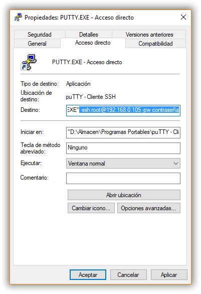

>   C:\\Users\\CaRLy\\AppData\\Local\\Microsoft\\Windows\\INetCache\\Content.Word\\sshot-67.png

>   Observar que las dos líneas significan lo mismo y tienen los mismos
>   componentes aun expresados de otra forma. De esas líneas, es obvio deducir
>   que debemos cambiar los datos adecuados para nuestra conexión particular.

>   Es interesante decir que este sistema vulnera la seguridad de nuestra OPI
>   dado que cualquiera que ejecutara el acceso directo tendría acceso total si
>   el usuario propuesto fuera **‘root’**, siempre podemos omitir la parte de la
>   línea **‘-pw contraseña’**. Eso haría que la conexión solo nos pidiera la
>   contraseña.

>   **Archivo BAT:**

>   En sí mismo un archivo BAT es un documento de texto **\*.TXT** renombrado
>   para indicarle al Windows que es un archivo que debe ejecutar los comandos
>   dentro descritos. Así pues, crearemos un nuevo documento de texto en el
>   **‘Escritorio’** por ejemplo seleccionando la opción en su menú contextual.
>   Le ponemos un nombre por ejemplo **‘Conexión OPI.bat’** y ahora lo editamos
>   seleccionando la opción entro de su menú contextual **‘Edita’**.

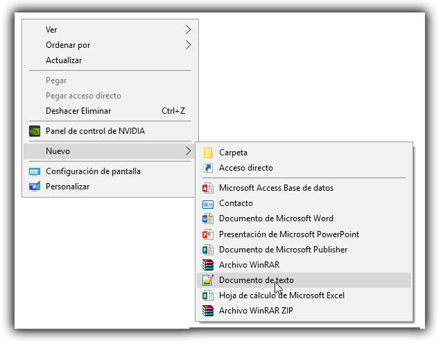

>   Dentro escribiremos uno de los siguientes comandos ya conocidos, pero con la
>   ruta donde tenemos el ejecutable del PUTTY.

>   *echo off*

>   *cls*

>   *“C:\\Directorio\\PUTYY\\PUTYY.exe” -ssh 192.168.0.000 -l usuario -pw
>   contraseña o*  
>   *“C:\\Directorio\\PUTYY\\PUTYY.exe” -ssh usuario\@192.168.0.000 -pw
>   contraseña*

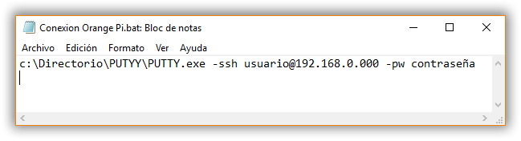

Guardamos y ya lo tenemos.

“Los más astutos podrán convertir ese archivo \*.bat en un ejecutable con una de
las múltiples herramientas que
[existen](https://sourceforge.net/projects/bat-to-exe/) para ello y así al
compilar el archivo nadie podrá ver la contraseña, pero si entrar igualmente”

7.4 Acceso al Directorio ‘Upload’ por Red Local.
------------------------------------------------

Una de las cosas a las que uno se acostumbra al trabajar con la Orange Pi Zero
controlando la impresora es, subirle los archivos \*.gcode ya compilados con la
aplicación de PC que más nos gusta, como
[Cura](https://ultimaker.com/en/products/cura-software) o
[Slic3r](http://slic3r.org/). Claro está que también se pueden subir los
archivos STL y crear los \*.gcode desde el Octoprint con sus plugins y demás
pero para un servidor es más lento y tedioso.

Acabas de diseñar una pieza, la importas con tu software preferido, sacas el
Gcode, lo guardas en tus discos y luego desde la misma máquina que tienes los
gcodes accedes a Octoprint y desde ahí buscas y seleccionas el archivo que
quieres imprimir…

Todo esto esta muy bien, pero y ¿si pudieras desde el Slic3r una vez “fileteas”
el gcode guardar directamente en el directorio donde guarda Octoprint los
archivos? Para muchos seria genial, eso podemos conseguirlo configurando el
servicio [SAMBA](https://es.wikipedia.org/wiki/Samba_(programa)):

7.5 Control visual a través de WebCam

Si somos de los que no nos gusta quedarnos mirando las 17 horas que va a tardar
en imprimir la pieza nuestra impresora o tenemos de cumplir con nuestras
obligaciones sociales aun que sea una vez al mes sacando a nuestra pareja a
pasea pero no queremos “perder” el tiempo dejando de imprimir o simplemente
tenemos la impresora en otro cuarto para que no nos moleste el ruido. Lo ideal
es vigilar el trabajo a través de una WebCam.

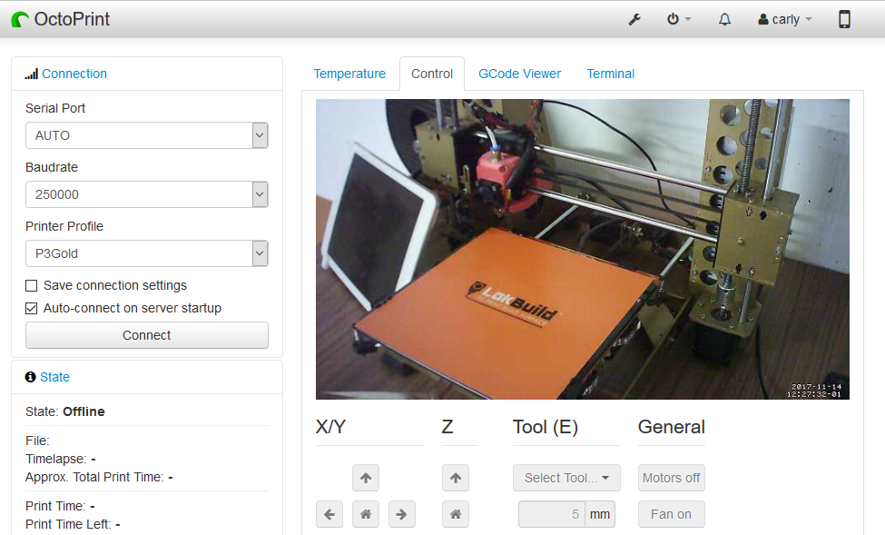

98 MANUALES, ESQUEMAS Y URLS CON INFORMACIÓN.
=============================================

Web Oficial Orange Pi [ [Web](http://www.orangepi.org) ].

Orange Pi Zero r1.1 Manual v0.9.1 [
[Descargar](mega:#!K11y1YhY!aaKAcEvmyfaRHzoesHtjktgULdCDGyAW5FKweDWVSfo) ].

Orange Pi Zero r1.1 Diseño PCB [
[Descargar](http://www.orangepi.org/download/ORANGE_PI-Zero-V1_1_PCB-DWG.rar) ].

Orange Pi Zero r1.1 Esquemas [
[Descargar](http://www.orangepi.org/download/orange_pi-zero-v1_11.pdf) ].

Modelo 3D OPI Zero v1.1 (by yo)
[[Web](https://grabcad.com/library/orange-pi-zero-v1-1-1)]

Web Oficial Octoprint [[Web](http://octoprint.org/)].

Proyecto Git OctoPrint [[Web](https://github.com/foosel/OctoPrint/)].

Documentation Octoprint [[Web](http://docs.octoprint.org/en/master/index.html)].

Wiki Octoprint [[Web](https://github.com/foosel/OctoPrint/wiki)].

Webs de recursos útiles para Orange Pi:

Tutoriales en Blog ‘Descubriendo la Orange Pi’
[[Web](https://descubriendolaorangepi.wordpress.com/)]

99 COMANDOS UTILES

Listar contenido del Directorio actual: ls

Acceder al contenido de un directorio: cd directorio  
cd /directorio1/directodio2

Copiar cp

Borrar Directorio: rm –dfr Directorio

Apagar Maquina: shutdown -h now

Uso de recursos (CPU-MEM-Servicios): top –i

Uso del disco: df –Th

Listar procesos ps –A

Asistente de Redes: nmtui

Gestor de Redes: nmcli d

Tutoriales Varios:

[Cómo buscar archivos en
Linux/Ubuntu](http://elpregunton.es/como-buscar-archivos-linux-ubuntu/)
